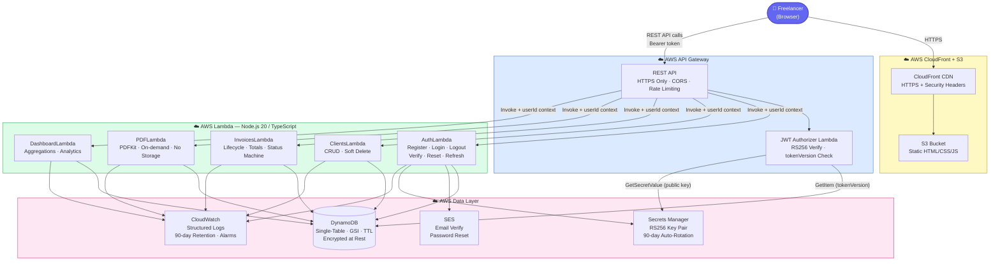
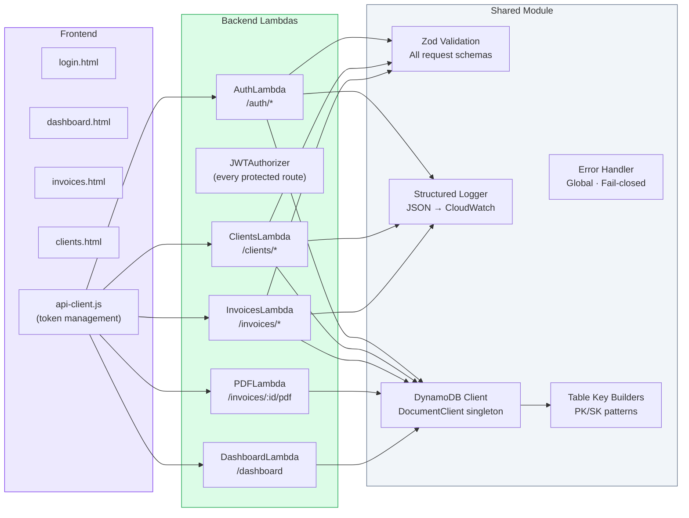
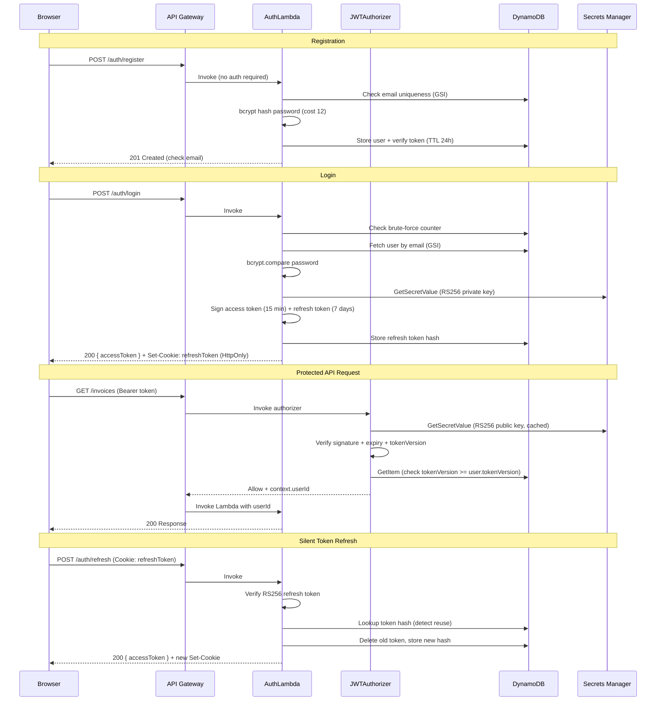
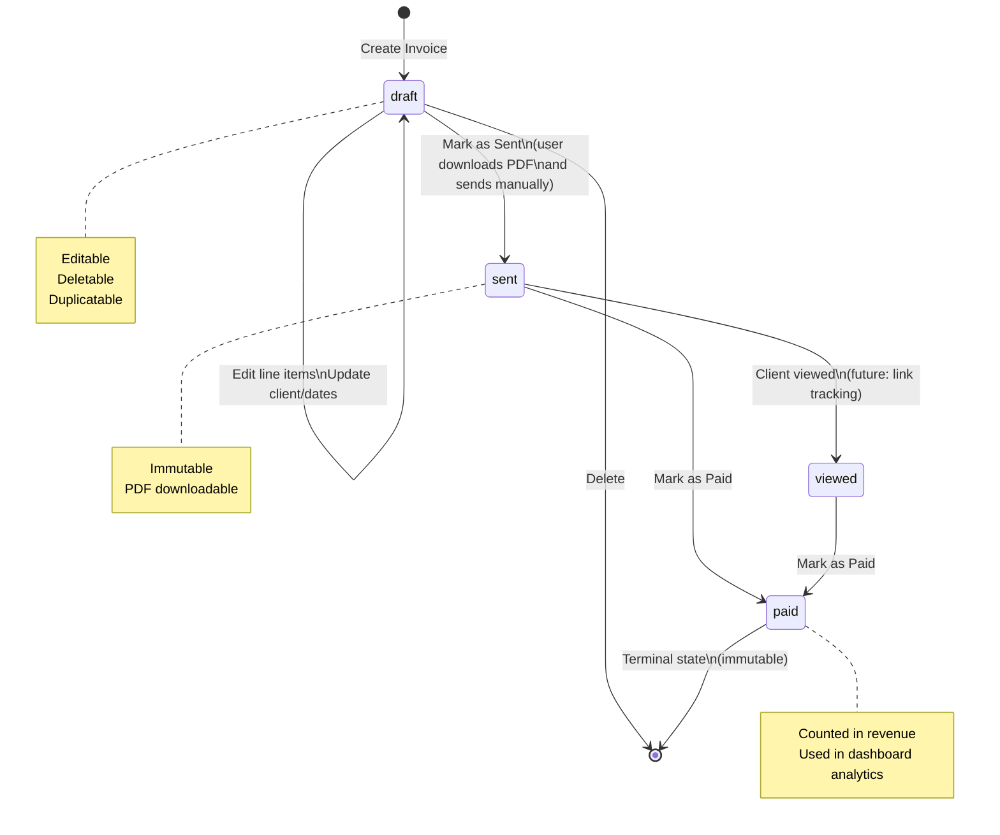

# QuickInvoice

> **Create professional invoices in seconds. Track payments. Get paid faster.**

A serverless invoice management platform built for freelancers — hosted entirely on AWS with no servers to manage.

[](https://www.typescriptlang.org/)
[](https://nodejs.org/)
[](https://aws.amazon.com/lambda/)
[](https://aws.amazon.com/dynamodb/)
[](LICENSE)

---

## Table of Contents

- [Features](#features)
- [Architecture Overview](#architecture-overview)
- [System Components](#system-components)
- [Authentication Flow](#authentication-flow)
- [Invoice Workflow](#invoice-workflow)
- [DynamoDB Data Model](#dynamodb-data-model)
- [API Reference](#api-reference)
- [Security](#security)
- [Project Structure](#project-structure)
- [Getting Started](#getting-started)
- [Environment Variables](#environment-variables)
- [Deployment](#deployment)
- [Running Tests](#running-tests)
- [Roadmap](#roadmap)

---

## Features

| Feature | Description |
|---|---|
| 🔐 **Authentication** | Email/password with RS256 JWT, refresh token rotation, brute-force protection |
| 👥 **Client Management** | Add, edit, and soft-delete client records |
| 🧾 **Invoice Creation** | Line items with tax, auto-numbered invoices, AUD currency |
| 📄 **PDF Download** | Server-side PDF generation via PDFKit — no storage needed |
| 📊 **Dashboard Analytics** | Outstanding, overdue, monthly/yearly revenue, top clients, avg payment time |
| 🔄 **Status Tracking** | `draft → sent → viewed → paid` state machine |
| 🔑 **Key Rotation** | RS256 asymmetric JWT — rotate without coordinated redeployment |
| 🛡️ **Security Hardened** | 15 OWASP-aligned security rules enforced throughout |

---

## Architecture Overview

QuickInvoice is a fully serverless application deployed on AWS. The frontend is a static site served from CloudFront + S3. All business logic runs in isolated Lambda functions behind API Gateway.



---

## System Components



---

## Authentication Flow

QuickInvoice uses **RS256 asymmetric JWT** — the private key signs tokens (AuthLambda only), the public key verifies them (JWTAuthorizer). Key rotation never requires coordinated redeployment.



### Token Security Model

| Token | Storage | Expiry | Rotation |
|---|---|---|---|
| Access Token | JS memory only (never `localStorage`) | 15 minutes | Issued fresh on each refresh |
| Refresh Token | `HttpOnly; Secure; SameSite=Strict` cookie | 7 days | Rotated on every use — reuse triggers full revocation |

---

## Invoice Workflow



### Financial Calculation Rules

All monetary values are stored as **integer cents** (AUD) to eliminate floating-point errors:

```
Subtotal  = Σ round(quantity × unitPrice)          [per line item, in cents]
Tax Total = Σ round(lineTotal × taxRate / 100)      [per line item, rounded]
Grand Total = Subtotal + Tax Total

Example:
  1 × $1,500.00 at 10% GST
  unitPrice = 150000 cents
  subtotal  = 150000 cents  ($1,500.00)
  taxTotal  =  15000 cents  ($150.00)
  grandTotal = 165000 cents ($1,650.00)
```

These rules are verified with **property-based tests** using [fast-check](https://fast-check.dev/):
- `grandTotal === subtotal + taxTotal` for all valid inputs
- All totals are always non-negative integers
- `formatInvoiceNumber` always produces `PREFIX-NNN` pattern

---

## DynamoDB Data Model

Single-table design — all entities in one table with composite keys.

```
Table: quickinvoice-{env}
┌─────────────────────────────┬──────────────────────────┬─────────────────────────┐
│ PK                          │ SK                       │ Entity                  │
├─────────────────────────────┼──────────────────────────┼─────────────────────────┤
│ USER#<userId>               │ PROFILE                  │ User profile            │
│ USER#<userId>               │ RTOKEN#<tokenId>         │ Refresh token (TTL)     │
│ USER#<userId>               │ VTOKEN#<tokenId>         │ Email verify token (TTL)│
│ USER#<userId>               │ PRTOKEN#<tokenId>        │ Password reset token    │
│ USER#<userId>               │ COUNTER                  │ Invoice auto-increment  │
│ USER#<userId>               │ CLIENT#<clientId>        │ Client record           │
│ USER#<userId>               │ INVOICE#<invoiceId>      │ Invoice record          │
│ ATTEMPTS#<email>            │ LOGIN                    │ Brute-force counter(TTL)│
└─────────────────────────────┴──────────────────────────┴─────────────────────────┘

GSI1 (for cross-entity lookups):
┌─────────────────────────────┬──────────────────────────┬─────────────────────────┐
│ GSI1-PK                     │ GSI1-SK                  │ Use Case                │
├─────────────────────────────┼──────────────────────────┼─────────────────────────┤
│ EMAIL#<email>               │ USER                     │ Login — find user       │
│ USER#<userId>               │ STATUS#<status>#<date>   │ Filter invoices by status│
└─────────────────────────────┴──────────────────────────┴─────────────────────────┘
```

**Why single-table?**
- No connection pool management in Lambda (each invocation is stateless)
- DynamoDB scales to any load with zero configuration
- All access patterns are known and modelled upfront

---

## API Reference

### Auth (public endpoints)

| Method | Path | Description |
|---|---|---|
| `POST` | `/auth/register` | Register with email + password |
| `POST` | `/auth/login` | Login, returns access token + sets cookie |
| `POST` | `/auth/logout` | Invalidate refresh token |
| `POST` | `/auth/refresh` | Rotate token pair silently |
| `GET` | `/auth/verify-email?token=` | Verify email address |
| `POST` | `/auth/forgot-password` | Send password reset email |
| `POST` | `/auth/reset-password` | Complete password reset |

### Clients 🔒

| Method | Path | Description |
|---|---|---|
| `GET` | `/clients` | List all clients |
| `POST` | `/clients` | Create client |
| `GET` | `/clients/:id` | Get client |
| `PUT` | `/clients/:id` | Update client |
| `DELETE` | `/clients/:id` | Soft-delete client |

### Invoices 🔒

| Method | Path | Description |
|---|---|---|
| `GET` | `/invoices` | List invoices (optional `?status=` filter) |
| `POST` | `/invoices` | Create invoice |
| `GET` | `/invoices/:id` | Get invoice |
| `PUT` | `/invoices/:id` | Update draft invoice |
| `DELETE` | `/invoices/:id` | Delete draft invoice |
| `POST` | `/invoices/:id/duplicate` | Duplicate as new draft |
| `PATCH` | `/invoices/:id/status` | Transition status (`sent` or `paid`) |
| `GET` | `/invoices/:id/pdf` | Download PDF |

### Dashboard 🔒

| Method | Path | Description |
|---|---|---|
| `GET` | `/dashboard` | Get all analytics aggregations |

🔒 = requires `Authorization: Bearer <access_token>`

---

## Security

QuickInvoice was built with 15 OWASP-aligned security rules enforced throughout:

| Area | Implementation |
|---|---|
| **JWT** | RS256 asymmetric signing — private key never leaves AuthLambda |
| **Key Rotation** | 90-day automated rotation via Secrets Manager Lambda. Zero-downtime — JWTAuthorizer re-fetches public key on verify failure |
| **Mass Revocation** | `tokenVersion` counter in DynamoDB. Incrementing it instantly invalidates all active sessions |
| **Passwords** | bcrypt cost factor 12. Never logged, stored in plaintext, or returned in responses |
| **Brute Force** | 5 failed logins within 15 minutes → account locked (DynamoDB TTL-based counter) |
| **Refresh Tokens** | Stored as SHA-256 hash. Rotation on every use. Reuse detected → all sessions revoked |
| **Input Validation** | Zod schemas on every API endpoint. Max-length on all string fields |
| **Authorization** | `userId` sourced exclusively from JWT context — never from request body or path params (IDOR prevention) |
| **Security Headers** | HSTS, CSP, X-Frame-Options, X-Content-Type-Options, Referrer-Policy on all responses |
| **Error Handling** | Global fail-closed handler. No stack traces or internal detail in user-facing errors |
| **Least Privilege** | Separate IAM role per Lambda with only the permissions that Lambda actually needs |
| **Encryption** | DynamoDB AES-256 at rest · TLS 1.2+ in transit · S3 SSE · HTTPS-only CloudFront |
| **Logging** | Structured JSON logs to CloudWatch. Secrets/tokens auto-redacted. 90-day retention |
| **Dependency Pinning** | Exact versions in `package.json`. `package-lock.json` committed |
| **CDN Integrity** | Chart.js loaded with SRI hash — tampered CDN scripts are rejected by browser |

See [`docs/credential-compromise-procedure.md`](docs/credential-compromise-procedure.md) for the full incident response runbook.

---

## Project Structure

```
quickinvoice/
├── src/
│   ├── auth/
│   │   ├── handlers/
│   │   │   ├── auth-handler.ts          # POST /auth/* routes
│   │   │   └── jwt-authorizer-handler.ts # Lambda Authorizer
│   │   └── services/
│   │       ├── auth-service.ts          # Register, login, reset, verify
│   │       ├── token-service.ts         # RS256 JWT issue/verify + key cache
│   │       └── brute-force-service.ts   # Login attempt tracking
│   ├── clients/
│   │   ├── handlers/clients-handler.ts
│   │   └── services/client-service.ts
│   ├── invoices/
│   │   ├── handlers/invoices-handler.ts
│   │   └── services/
│   │       ├── invoice-service.ts       # CRUD + status machine + numbering
│   │       └── invoice-calculator.ts    # Pure financial functions (PBT target)
│   ├── pdf/
│   │   ├── handlers/pdf-handler.ts
│   │   ├── services/pdf-service.ts
│   │   └── templates/invoice-template.ts # PDFKit layout
│   ├── dashboard/
│   │   ├── handlers/dashboard-handler.ts
│   │   └── services/
│   │       ├── dashboard-service.ts
│   │       └── dashboard-calculator.ts  # Pure aggregation functions (PBT target)
│   └── shared/
│       ├── db/
│       │   ├── dynamodb-client.ts       # DocumentClient singleton
│       │   └── table-keys.ts           # PK/SK builders for all entities
│       ├── types/index.ts              # All domain types
│       ├── middleware/auth-middleware.ts
│       └── utils/
│           ├── validation.ts           # Zod schemas
│           ├── logger.ts               # Structured JSON logger
│           ├── error-handler.ts        # Global fail-closed handler
│           └── response.ts            # API Gateway response + security headers
├── frontend/
│   ├── css/
│   │   ├── main.css                   # Design tokens, reset, typography
│   │   └── components.css             # Nav, buttons, cards, forms, tables, badges
│   ├── js/
│   │   └── api-client.js              # Fetch wrapper + token management
│   ├── login.html
│   ├── register.html
│   └── dashboard.html
├── tests/
│   ├── unit/
│   │   ├── invoices/invoice-calculator.test.ts  # 15 property-based tests
│   │   └── dashboard/dashboard-calculator.test.ts # 10 property-based tests
│   └── integration/                   # API integration tests
├── docs/
│   └── credential-compromise-procedure.md
├── aidlc-docs/                        # AI-DLC workflow documentation
│   ├── inception/                     # Requirements, architecture, application design
│   └── construction/                  # Code generation plan + progress
├── template.yaml                      # AWS SAM — all infrastructure as code
├── package.json
├── tsconfig.json
└── .env.example
```

---

## Getting Started

### Prerequisites

- Node.js 20+
- AWS CLI configured (`aws configure`)
- AWS SAM CLI — [installation guide](https://docs.aws.amazon.com/serverless-application-model/latest/developerguide/install-sam-cli.html)
- Docker (for `sam local`)
- An AWS account with SES sender domain verified

### 1. Install dependencies

```bash
npm install
```

### 2. Generate RS256 key pair (first-time setup)

```bash
openssl genrsa -out private.pem 2048
openssl rsa -in private.pem -pubout -out public.pem

# Store in Secrets Manager
aws secretsmanager create-secret \
  --name quickinvoice/jwt-private-key \
  --secret-string file://private.pem

aws secretsmanager create-secret \
  --name quickinvoice/jwt-public-key \
  --secret-string file://public.pem

# Remove local copies immediately
shred -u private.pem public.pem   # Linux/Mac
# Windows: del private.pem public.pem
```

### 3. Configure environment

```bash
cp .env.example .env.local.json
# Fill in your values (ARNs, email address, base URL)
```

### 4. Build and run locally

```bash
npm run build
sam local start-api --env-vars .env.local.json
```

---

## Environment Variables

| Variable | Required | Description |
|---|---|---|
| `DYNAMODB_TABLE_NAME` | ✅ | Table name e.g. `quickinvoice-dev` |
| `JWT_PRIVATE_KEY_SECRET_ARN` | ✅ | Secrets Manager ARN for RS256 private key |
| `JWT_PUBLIC_KEY_SECRET_ARN` | ✅ | Secrets Manager ARN for RS256 public key |
| `SES_FROM_ADDRESS` | ✅ | Verified SES sender e.g. `noreply@quickinvoice.com` |
| `APP_BASE_URL` | ✅ | Base URL for email links e.g. `https://app.quickinvoice.com` |
| `AWS_REGION` | ✅ | AWS region e.g. `ap-southeast-2` |
| `JWT_ISSUER` | — | JWT issuer claim (default: `quickinvoice`) |
| `JWT_AUDIENCE` | — | JWT audience claim (default: `quickinvoice-api`) |
| `ACCESS_TOKEN_EXPIRY_SECONDS` | — | Access token TTL (default: `900` = 15 min) |
| `REFRESH_TOKEN_EXPIRY_SECONDS` | — | Refresh token TTL (default: `604800` = 7 days) |

---

## Deployment

```bash
# Build TypeScript
npm run build

# Deploy to dev
sam deploy \
  --stack-name quickinvoice-dev \
  --parameter-overrides \
    Environment=dev \
    JWTPrivateKeySecretArn=<arn> \
    JWTPublicKeySecretArn=<arn> \
  --capabilities CAPABILITY_IAM \
  --resolve-s3

# Deploy to prod
sam deploy \
  --stack-name quickinvoice-prod \
  --parameter-overrides \
    Environment=prod \
    JWTPrivateKeySecretArn=<arn> \
    JWTPublicKeySecretArn=<arn> \
    AppBaseUrl=https://app.quickinvoice.com \
  --capabilities CAPABILITY_IAM \
  --resolve-s3
```

### Lambda Configuration

| Function | Memory | Timeout | Reason |
|---|---|---|---|
| AuthLambda | 256 MB | 10s | bcrypt is CPU-intensive |
| JWTAuthorizerLambda | 128 MB | 3s | Runs on every request — must be fast |
| ClientsLambda | 128 MB | 10s | Standard CRUD |
| InvoicesLambda | 128 MB | 10s | Standard CRUD + calculations |
| PDFLambda | 512 MB | 30s | PDFKit rendering |
| DashboardLambda | 128 MB | 15s | In-memory aggregation |

---

## Running Tests

```bash
# Unit tests with property-based tests (fast-check)
npm run test:unit

# Integration tests (requires deployed or local API)
npm run test:integration

# All tests with coverage report
npm run test:coverage
```

### Property-Based Test Coverage

Financial calculations are verified with [fast-check](https://fast-check.dev/) over thousands of randomly generated inputs:

```
invoice-calculator.test.ts
  calculateSubtotal
    ✓ PBT: always non-negative for valid inputs
    ✓ PBT: result is an integer (cents, no floating point)
    ✓ PBT: single item subtotal equals round(quantity × unitPrice)
    ✓ PBT: subtotal of combined items equals sum of individual subtotals
  calculateTaxTotal
    ✓ PBT: always non-negative
    ✓ PBT: result is an integer
    ✓ PBT: zero tax rate always produces zero tax
  calculateTotals
    ✓ PBT: grandTotal === subtotal + taxTotal for all inputs
    ✓ PBT: all totals are non-negative integers
  Status transitions
    ✓ All valid transitions pass
    ✓ All invalid transitions throw AppError

dashboard-calculator.test.ts
    ✓ PBT: outstanding never negative, never exceeds total
    ✓ PBT: overdue always ≤ outstanding
    ✓ PBT: monthly revenue always ≤ yearly revenue
    ✓ PBT: top clients count ≤ unique client count
```

---

## Roadmap

| Feature | Status |
|---|---|
| Core MVP (auth, clients, invoices, PDF, dashboard) | ✅ Complete |
| RS256 JWT + 90-day key rotation | ✅ Complete |
| Property-based tests on financial calculations | ✅ Complete |
| Remaining frontend pages (clients, invoices, editor) | 🔄 In progress |
| Integration tests | 🔄 In progress |
| Stripe subscription billing ($9/month + 30-day trial) | 📋 Planned |
| Platform email sending (invoice delivery to clients) | 📋 Planned |
| Public invoice link + client-facing portal | 📋 Planned |
| Google / GitHub OAuth | 📋 Planned |
| PDF storage + audit trail (S3) | 📋 Planned |
| Multi-currency support | 📋 Planned |

---

## Contributing

Pull requests are welcome. For major changes please open an issue first.

1. Fork the repo
2. Create a feature branch (`git checkout -b feat/your-feature`)
3. Commit your changes
4. Push to the branch and open a PR against `main`

## License

[MIT](LICENSE)

---

> Built with [AI-DLC](https://github.com/awslabs/aidlc-workflows) — AI-Driven Development Life Cycle
